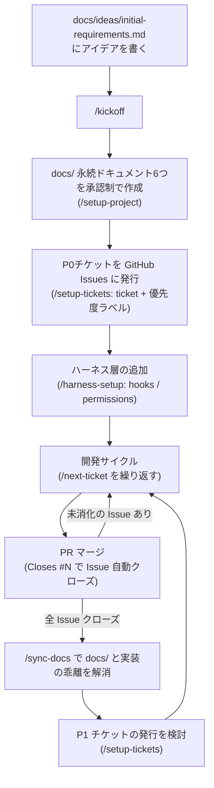
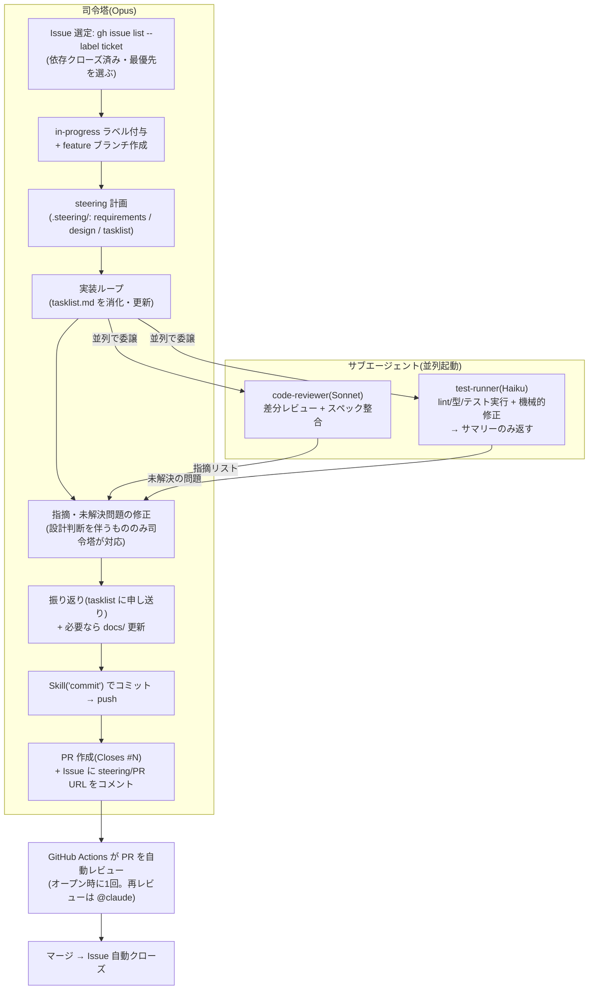

# claude-code-template

スペック駆動開発 + ハーネスエンジニアリングのための Claude Code プロジェクトテンプレート。

- **スペック駆動開発**: 永続ドキュメント(`docs/`)で「何を作るか」を定義し、作業単位のステアリングファイル(`.steering/`)で「今回何をするか」を計画してから実装する
- **ハーネスエンジニアリング**: hooks / permissions / subagents / Agent Teams で「必ず起こすべきこと」を仕組みで保証する
- **モデル戦略**: 司令塔 = Opus、委譲作業 = Sonnet、最難関タスクのみ Fable 5 に一時切替

---

## プロジェクト開始手順

> **最短ルート**: Step 0 のあと、アイデアを `docs/ideas/initial-requirements.md` に書いて **`/kickoff`** を実行すると、Step 2〜4 + README のプロダクト化までを対話的に一気通貫でガイドします。

### Step 0: リポジトリの準備

1. GitHub で **Use this template** から新規リポジトリを作成する
   - (テンプレート配布側の設定: Settings → General で **Template repository** を有効化しておく)
2. 新リポジトリの Settings → Secrets and variables → Actions に **`CLAUDE_CODE_OAUTH_TOKEN`** を設定する
   - 未設定の間、PR 自動レビュー・`@claude` メンションの Actions はスキップされる(失敗はしない)
   - 機械的な品質ゲート(`ci.yml`: lint・型チェック・フォーマット・テスト・secretlint・npm audit)はシークレット不要で常に走る
3. Settings → Code security で **Secret scanning + Push protection** を有効化する(公開リポジトリなら無料)
   - リポジトリ内の secretlint(pre-commit / CI)と合わせた二段構えになる
4. devcontainer で開く(VS Code / GitHub Codespaces)
   - `post_create.sh` が Claude Code のインストールと GitHub 認証を自動で行う(GitHub は OS の環境変数から認証。Claude Code の認証は初回 `claude` 実行時に一度だけ走る)
   - devcontainer の表示名(`devcontainer.json` の `name`)は `/kickoff` フェーズ5がプロダクト名に書き換える
5. ターミナルで `claude` を起動し、以下を確認する:
   - `/model` が **Opus** になっていること(`.claude/settings.json` で司令塔として固定済み)
   - `gh auth status` が認証済みであること

### Step 1: アイデアの言語化

作りたいものの構想を **`docs/ideas/initial-requirements.md`** に書く(見出し構造の雛形が用意済み)。

- 全項目を埋める必要はない。空欄は `/setup-project` の対話で補完される
- 記入例: `docs/template-dev/initial-requirements.example.md`
- Claude Code に「このアイデアについて壁打ちして」と依頼して対話しながら書いてもよい
- 補足資料(技術調査メモ等)は同じ `docs/ideas/` に追加してよい(`*.example.md` は読み込み対象外)
- 技術スタックがテンプレート既定(Node.js/TypeScript)と異なる場合(モバイルアプリ等)も、そのまま書けばよい。`/kickoff` が検証コマンド・devcontainer・ツールチェーンの置換を提案する

### Step 2: 永続ドキュメントの作成 — `/setup-project`

```
> /setup-project
```

対話形式で以下の 6 つを **1 ファイルずつ、承認を取りながら** 作成する。

| ドキュメント                | 内容                                                 |
| --------------------------- | ---------------------------------------------------- |
| `product-requirements.md`   | プロダクト要求定義書(何を作るか・ユーザーストーリー) |
| `functional-design.md`      | 機能設計書(機能の振る舞い)                           |
| `architecture.md`           | 技術仕様書(技術スタック・非機能要件)                 |
| `repository-structure.md`   | リポジトリ構造定義書                                 |
| `development-guidelines.md` | 開発ガイドライン(規約・検証コマンド)                 |
| `glossary.md`               | ユビキタス言語定義                                   |

詳細なレビューが必要なときは `/review-docs docs/product-requirements.md` のように依頼する。

### Step 3: 実装計画の分割(任意)

```
> /setup-tickets            # 永続ドキュメントを段階的な実装チケットに分割 → GitHub Issues に発行
> /setup-spoke-standards    # スポーク公開向けの構成ルールを生成(必要な場合のみ)
```

チケットは GitHub Issues(`ticket` + 優先度ラベル)で管理する。ステータス更新のコミットが不要になり、PR の `Closes #N` でマージ時に自動クローズされる。並行作業(複数ブランチ・Agent Teams)でもチケット状態が競合しない。

### Step 4: ハーネス層の追加 — `/harness-setup`

検証コマンド(lint / typecheck / test)が確定したら実行する。

```
> /harness-setup
```

対話形式で以下を生成・統合する:

- **CLAUDE.md への「ハーネス」節追記**(検証コマンド・必須ルール・委譲ルール)
- **settings.json の統合**(危険コマンドの `permissions.deny`・lint/typecheck 非同期 hook は既定導入済み。プロジェクト固有の deny パターンや hook をここで統合する)
- **worker subagents**(code-reviewer は導入済み。security-reviewer 等を必要に応じ追加。全て Sonnet)
- **Agent Teams の有効化**(任意。experimental)と `.harness/`(decisions.jsonl / team_runbook.md)

Agent Teams を有効化した場合は、`/config` で **Default teammate model を Sonnet** に設定し、Claude Code を再起動して環境変数を反映する。

### Step 5: 開発サイクル

基本は普通に会話で依頼すればよい。定型フローにはコマンドを使う。

```
> /status                                # 現在地の確認と次の一手の提案
> /next-ticket                           # 次のチケットに着手(ステータス管理込み)
> /add-feature ユーザープロフィール編集   # 機能追加(計画→実装→検証→PR まで自動)
> /fix-issue 42                          # GitHub Issue の修正と PR 作成
> /check                                 # lint・型チェック・テスト・フォーマット一括実行&自動修正
> /commit                                # 変更を適切な粒度でコミット
> /resume-work                           # 中断した .steering/ の作業を再開
> /sync-docs                             # 実装と docs/ の乖離を検出・更新
```

作業計画・実装・振り返りは `steering` スキルが `.steering/[YYYYMMDD]-[タスク名]/` に記録する(`/add-feature` 等が内部で使用)。

---

## 実運用フロー

### 全体の流れ(プロジェクトライフサイクル)



### チケット1件の実装フロー(委譲構造)

司令塔(Opus)は判断と統合に専念し、ログの長い作業・レビューはサブエージェントに委譲する。



補足:

- **広範囲のコード探索**(実装前の類似実装調査など)は組み込みの Explore サブエージェントに委譲し、司令塔は結論だけ受け取る
- **`/sync-docs`** も乖離検出フェーズを読み取り専用サブエージェント(Sonnet)に委譲し、更新判断は司令塔が行う
- **Edit/Write 直後に prettier が自動実行**され、lint・型チェックも非同期で走る(PostToolUse hooks)。フォーマット起因のチェック失敗は原則発生せず、型エラーも早期に検知される
- **危険コマンドは二段構えでブロック**する(`permissions.deny` + PreToolUse の `block-dangerous-cmds.sh` パターン検査)
- **PR ボディは `.github/pull_request_template.md`** に従う(`Closes #N` と `.steering/` ディレクトリ名を記録する)
- **Claude Code on the web** から開いた場合は SessionStart hook が `npm install` を自動実行する(devcontainer 不要で `/check` が通る)。web のリモート環境には `gh` CLI がないため、GitHub 操作は MCP ツールで代替される(CLAUDE.md に明記済み)
- **MCP は最小構成**: 既定は Context7(最新ライブラリドキュメント参照。`.mcp.json` に登録済み、初回セッションで承認が必要)のみ。プロジェクト特性に応じた追加は `/kickoff` フェーズ1.5 が提案する(判断基準: `.claude/docs/mcp-introduction-guide.md`)
- **`/clear`・resume 後は SessionStart hook が現在地を自動注入**する(ブランチ・未コミット変更・in-progress Issue・最新 `.steering/` の未完了タスク)。web リモートは毎回新セッションで始まるため、セッション開始時にも注入される
- **チケット完了(PR 作成)ごとに `/clear`** してから次の `/next-ticket` を始める。作業状態は Issue・`.steering/`・git に永続化済みなので、コンテキストを持ち越す必要がない(トークン消費の最大の削減ポイント)

---

## モデル運用方針

| 役割                          | モデル                | 備考                                                                      |
| ----------------------------- | --------------------- | ------------------------------------------------------------------------- |
| 司令塔(メインセッション)      | **Opus**              | 計画・設計判断・統合・報告。プロジェクト設定で固定済み                    |
| 委譲作業(subagent / teammate) | **Sonnet**            | レビュー(code-reviewer)・検証(implementation-validator)・調査(Explore)    |
| 品質チェック実行              | **Haiku**             | test-runner。lint/テスト実行と機械的修正、サマリーのみ返す                |
| 最難関タスク                  | **Fable 5**(一時切替) | 難度の高い設計・原因不明の調査のみ。`/model fable` → 完了後 `/model opus` |

---

## コマンド早見表

| コマンド                 | タイミング               | 内容                                |
| ------------------------ | ------------------------ | ----------------------------------- |
| `/setup-project`         | 初回                     | 永続ドキュメント 6 つを対話作成     |
| `/setup-tickets`         | 初回(任意)               | 実装チケットを GitHub Issues に発行 |
| `/setup-spoke-standards` | 初回(任意)               | スポーク公開向け構成ルール          |
| `/harness-setup`         | 初回(検証コマンド確定後) | ハーネス層の追加                    |
| `/add-feature [機能]`    | 日常                     | 機能追加の全自動フロー              |
| `/fix-issue [番号]`      | 日常                     | Issue 修正と PR 作成                |
| `/check`                 | 日常                     | 品質チェック一括実行&自動修正       |
| `/commit`                | 日常                     | 適切な粒度でのコミット              |
| `/resume-work`           | 日常                     | 中断作業の再開                      |
| `/sync-docs`             | 定期                     | 実装とドキュメントの同期            |
| `/review-docs [パス]`    | 随時                     | ドキュメントの詳細レビュー          |
| `/kickoff`               | 初回                     | Step 2〜4 を一気通貫で実行          |
| `/next-ticket`           | 日常                     | 次のチケットに着手                  |
| `/status`                | 随時                     | 現在地と次の一手                    |

## ディレクトリ構造

```
docs/                  永続ドキュメント(プロジェクトの北極星)
├── ideas/             下書き・アイデア(開始の起点は initial-requirements.md)
└── template-dev/      テンプレート開発の記録・記入例(開発開始後は削除可)
.steering/             作業単位の計画・タスクリスト(作業ごとに作成、履歴として保持)
.harness/              ハーネス状態(decisions.jsonl 等。/harness-setup が生成)
.claude/
├── agents/            サブエージェント定義(レビュー系 Sonnet / test-runner は Haiku)
├── skills/            スキル(steering, harness-setup ほか)
├── commands/          スラッシュコマンド
├── docs/              恒久参照ガイド(MCP 導入ガイド・serena 再導入手順。プロジェクト開始後も残す)
└── settings.json      モデル固定・権限・hooks
```

## 免責事項

- **危険コマンドのブロックはベストエフォート**: `permissions.deny` と `block-dangerous-cmds.sh` は文字列パターンによる防衛線であり、サンドボックスではない。変数展開等による迂回は原理的に防げないため、本当の境界は permission mode と実行環境の隔離(devcontainer / リモート環境)が担う
- **AI レビューは人間のレビューを代替しない**: Claude による自動レビュー(PR レビュー・code-reviewer subagent)は見落としがありうる。マージ判断と生成されたコード・ドキュメントの最終的な検証責任は利用者にある
- **利用料金は利用者の負担**: GitHub Actions の実行時間、Claude API / サブスクリプションのトークン消費は、このテンプレートの構成(自動レビュー・subagent 委譲・hooks)によって発生する。各 Actions には `timeout-minutes` を設定済みだが、コストの監視は利用者が行う
- 本テンプレートは MIT ライセンスに基づき**無保証**で提供される(下記ライセンス参照)

## ライセンス

[LICENSE](./LICENSE) を参照。
