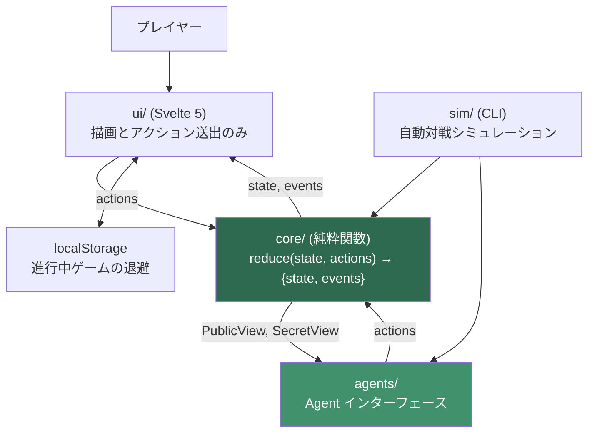
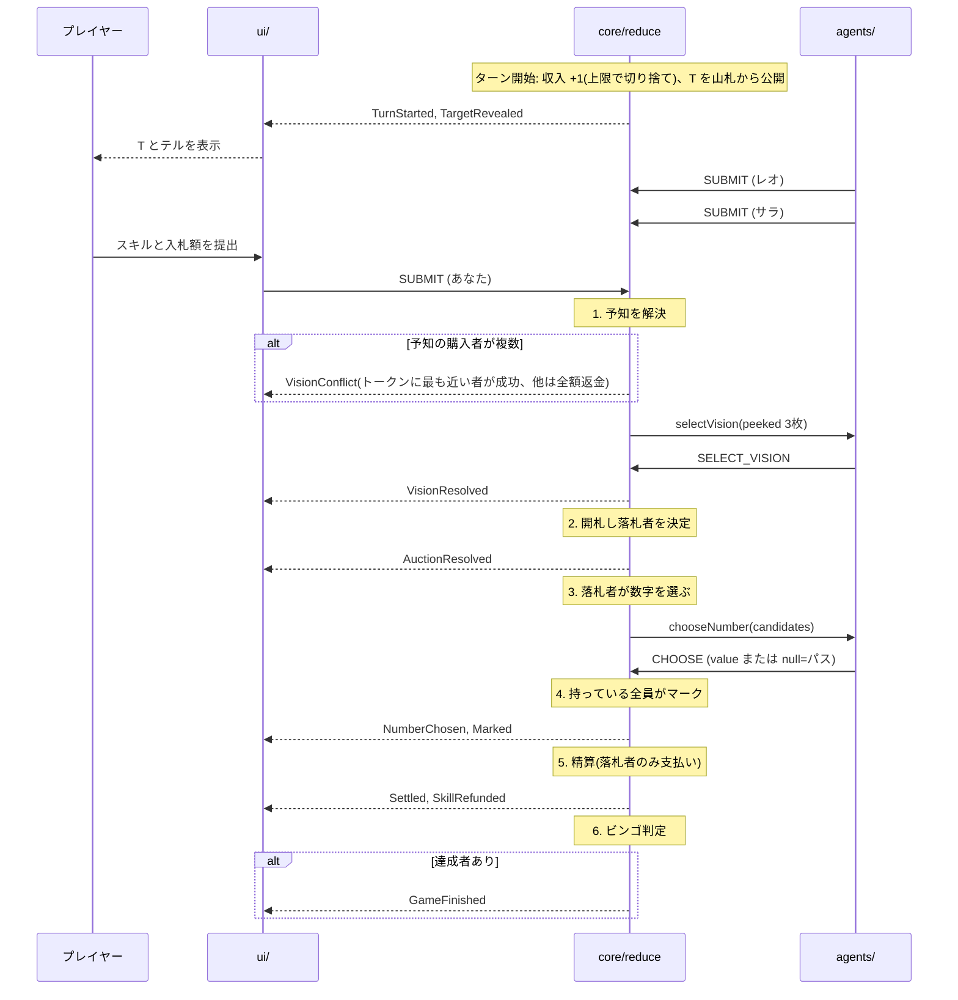
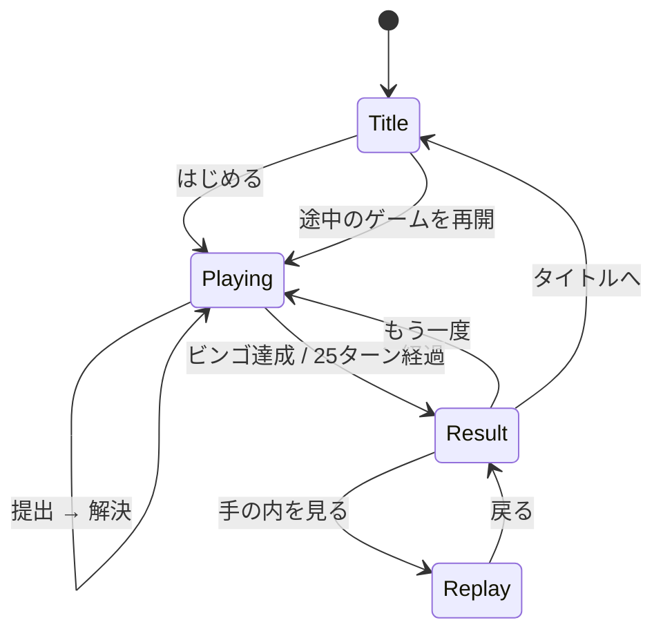

# 機能設計書 (Functional Design Document)

> 本書は `docs/product-requirements.md` の要件を技術的に実現する方法を定義する。
> ゲームルールの成立根拠(なぜこの数値・この処理順序なのか)は `docs/ideas/initial-requirements.md` の改訂履歴を参照する。

## システム構成図



**設計の中心は `core/` が UI・通信・時間・乱数のいずれにも依存しないこと。** `sim/` は UI を通さず同じ `core/` を叩き、P1 のサーバー移行では `core/` をそのままサーバーへ移送する。

## 技術スタック

| 分類 | 技術 | 選定理由 |
|------|------|----------|
| 言語 | TypeScript 6.x | 判別可能ユニオンでゲーム状態とイベントを型で表現でき、リデューサの網羅性をコンパイラに担保させられる |
| UI | Svelte 5 (runes) | 既存スポーク `kanji_gacha` と同構成。ロジックが `core/` に分離済みで UI 層が薄いため、ボイラープレートの少なさとバンドルの軽さが直接効く |
| ビルド | Vite 8 | 静的サイト出力。`sim/` も同一の TS 設定で実行できる |
| テスト | Vitest 4 | Vite と設定を共有。シード固定の決定性テストと相性が良い |
| 配信 | Cloudflare Pages | 既存スポークと同じ配信基盤(`wrangler.toml`)。P1 でサーバー化する際は Durable Objects が同一プラットフォーム上の選択肢になる |
| 乱数 | 自前実装(mulberry32 相当) | `Math.random()` は状態を外部に持ちシードを固定できない。リプレイ・シミュレーション・デバッグの前提として state 内に持つ必要がある |

## データモデル定義

### バランス定数 `BalanceConfig`

**すべての調整可能な数値をこの1箇所に集約する。** コード中に数値リテラルを置かない。

```typescript
interface BalanceConfig {
  playerCount: 3;
  maxTurns: number;                 // 25
  board: {
    size: 5;                        // 5x5
    freeCenter: boolean;            // true (N列3行目)
    columns: [number, number][];    // [[1,8],[9,16],[17,24],[25,32],[33,40]]
    pickPerColumn: number;          // 5 (各列8個から5個)
  };
  economy: {
    initialCoins: number;           // 15
    coinCap: number;                // 30
    incomePerTurn: number;          // 1
    distributionDivisor: number;    // 4 → 各敗者の受取額 = floor(bid / 4)
  };
  skills: {
    shift: { cost: number; range: number };   // 4 / ±1
    vision: { cost: number; peek: number };   // 5 / 3枚
    greed: { cost: number; range: number };   // 6 / ±2
  };
}
```

**制約**:
- `board.columns` の各範囲は互いに素で、和が数字プール全体を覆うこと。
- `pickPerColumn` は各列の範囲の広さ以下であること(5 ≤ 8)。
- `distributionDivisor` は `playerCount + 1` 以上であること。これを下回ると分配総額が入札額を超え、コインが増殖する。

### 盤面 `Board`

```typescript
type CellValue = number | 'FREE';

interface Cell {
  value: CellValue;
  marked: boolean;
}

/** board[col][row]。col 0..4 が B/I/N/G/O、row 0..4 が上から下。 */
type Board = Cell[][];
```

**制約**:
- `board[c][r].value` は `columns[c]` の範囲内、または中央のみ `'FREE'`。
- 同一盤面内に同じ数字は現れない(列ごとに範囲が排他のため、列内の重複だけ排除すればよい)。
- `'FREE'` セルは生成時点で `marked: true`。以後変化しない。

### プレイヤー `PlayerState`

```typescript
type PlayerId = 'p0' | 'p1' | 'p2';

interface PlayerState {
  id: PlayerId;
  name: string;               // 'あなた' | 'レオ' | 'サラ'
  kind: 'human' | 'cpu';
  board: Board;
  coins: number;              // 0 以上 coinCap 以下
}
```

### 提出 `Submission`

```typescript
type SkillId = 'shift' | 'vision' | 'greed';

interface Submission {
  playerId: PlayerId;
  skill: SkillId | null;
  bid: number;                // 0 以上。上限は coins - skillCost(skill)
}
```

**制約**: `bid + skillCost(skill) <= coins`。スキル代は「予約」として入札可能額から差し引かれる。

### ゲーム状態 `GameState`

```typescript
type Phase =
  | 'submitting'      // 全員の提出待ち
  | 'vision'          // 予知の成功者が3枚から1枚を選ぶ待ち
  | 'choosing'        // 落札者が数字を選ぶ(またはパス)待ち
  | 'finished';

interface RngState {
  seed: number;
  counter: number;    // 消費回数。state に持つことで再現性を担保する
}

interface GameState {
  config: BalanceConfig;
  rng: RngState;
  turn: number;                 // 1..maxTurns
  phase: Phase;
  deck: number[];               // 未公開の数字。先頭が次に引かれる
  target: number;               // 今ターンの T
  players: PlayerState[];
  tokenIndex: number;           // 優先権トークン保持者の players 上の添字
  reserved: Record<PlayerId, number>;      // 予約中のスキル代
  submissions: Submission[];               // ★秘匿。開札まで他者に見せない
  visionPeek: Record<PlayerId, number[]>;  // ★秘匿。予知で見た3枚(本人のみ)
  auctionWinner: PlayerId | null;
  candidates: number[];         // 落札者が選べる数字(範囲外は除外済み)
  log: GameEvent[];
  result: GameResult | null;
}
```

### イベント `GameEvent`

リプレイ・ログ・UI 演出のすべてがこのイベント列から復元される。**`reduce` は state だけでなく必ず events を返す。**

```typescript
type GameEvent =
  | { type: 'TurnStarted'; turn: number; income: number; capped: PlayerId[] }
  | { type: 'TargetRevealed'; target: number }
  | { type: 'Submitted'; playerId: PlayerId; skill: SkillId | null; bid: number }
  | { type: 'VisionConflict'; buyers: PlayerId[]; winner: PlayerId; refunded: PlayerId[] }
  | { type: 'VisionResolved'; playerId: PlayerId; peeked: number[]; kept: number }
  | { type: 'AuctionResolved'; winner: PlayerId; bid: number; tiebreak: boolean }
  | { type: 'NumberChosen'; playerId: PlayerId; value: number | null }  // null = パス
  | { type: 'Marked'; value: number; markedBy: PlayerId[] }
  | { type: 'Settled'; payer: PlayerId; paid: number; received: Record<PlayerId, number>; toBank: number }
  | { type: 'SkillRefunded'; playerId: PlayerId; amount: number; reason: 'lost-auction' | 'vision-conflict' }
  | { type: 'GameFinished'; result: GameResult };
```

### 結果 `GameResult`

```typescript
interface GameResult {
  kind: 'bingo' | 'draw-bingo' | 'timeup' | 'draw-timeup';
  winners: PlayerId[];          // 引き分けなら複数
  decidedBy: 'bingo' | 'reachCount' | 'markCount' | 'coins' | 'none';
  turn: number;
  standings: {
    playerId: PlayerId;
    reachCount: number;
    markCount: number;
    coins: number;
    lines: number;              // 完成ライン数
  }[];
}
```

`decidedBy` を持つのは、PRD の受け入れ条件「どの基準で決まったかが結果画面に表示される」を満たすため。

### エージェントに渡すビュー

```typescript
/** 全員が見てよい情報。CPU はこれと自分の SecretView しか受け取れない。 */
interface PublicView {
  config: BalanceConfig;
  turn: number;
  target: number;
  deckSize: number;                    // 残り枚数のみ。中身は渡さない
  tokenIndex: number;
  players: {
    id: PlayerId;
    name: string;
    board: Board;                      // 盤面は常時公開
    coins: number;
    reserved: number;                  // 予約額は公開(スキルの有無は分かるが種類は分からない)
  }[];
  history: PublicTurnRecord[];         // 過去ターンの開札結果(入札額・スキル・選択)
}

/** 自分だけが見てよい情報。 */
interface SecretView {
  playerId: PlayerId;
  visionPeek: number[] | null;         // 予知が成功したターンのみ
}

interface Agent {
  submit(pub: PublicView, sec: SecretView): { skill: SkillId | null; bid: number };
  chooseNumber(pub: PublicView, sec: SecretView, candidates: number[]): number | null;
  selectVision(pub: PublicView, sec: SecretView, peeked: number[]): number;
  /** UI 表示用。意思決定には影響しない。 */
  tell(pub: PublicView, sec: SecretView): string;
}
```

**この型が「CPU は非公開情報を参照しない」という PRD の受け入れ条件を構造的に保証する。** `PublicView` に他者の `submissions` も `deck` の中身も存在しないため、CPU 実装は参照しようがない。

## コンポーネント設計

### `core/config.ts`

**責務**: バランス定数の定義と検証。

```typescript
export const DEFAULT_CONFIG: BalanceConfig;
export function validateConfig(config: BalanceConfig): void;  // 制約違反は throw
```

### `core/rng.ts`

**責務**: シードから決定的な乱数列を生成する。

```typescript
export function next(rng: RngState): [value: number, next: RngState];  // [0,1)
export function nextInt(rng: RngState, maxExclusive: number): [number, RngState];
export function shuffle<T>(rng: RngState, items: T[]): [T[], RngState];
```

**依存関係**: なし。**`Math.random()` を呼ばない。** 状態を引数で受け取り、新しい状態を返す純粋関数として実装する。

### `core/board.ts`

**責務**: 盤面の生成・マーク・判定。

```typescript
export function createBoard(config: BalanceConfig, rng: RngState): [Board, RngState];
export function markNumber(board: Board, value: number): Board;    // 非破壊
export function completedLines(board: Board): number;
export function reachCount(board: Board): number;                   // 4マークのライン本数
export function markCount(board: Board): number;                    // FREE を含む
```

**ライン定義**: 縦5 + 横5 + 斜め2 = 12本。FREE セルは常にマーク済みとして数える。

### `core/reduce.ts`

**責務**: ゲームの唯一の状態遷移。

```typescript
type Action =
  | { type: 'SUBMIT'; playerId: PlayerId; skill: SkillId | null; bid: number }
  | { type: 'SELECT_VISION'; playerId: PlayerId; keep: number }
  | { type: 'CHOOSE'; playerId: PlayerId; value: number | null };

export function createGame(config: BalanceConfig, seed: number): GameState;
export function reduce(state: GameState, actions: Action[]): { state: GameState; events: GameEvent[] };
export function legalActions(state: GameState, playerId: PlayerId): Action[] | ActionSpec;
```

**依存関係**: `config` / `rng` / `board` のみ。UI・DOM・タイマー・I/O に依存しない。

**不変条件**(すべてテストで担保する):
- 同一の `(config, seed, actions[])` からは常に同一の `state` と `events` が得られる。
- 全プレイヤーのコイン総和は、銀行への回収分を除いて増加しない。
- `state` は不変オブジェクトとして扱い、`reduce` は入力 state を破壊しない。

### `agents/`

**責務**: 意思決定。`Agent` インターフェースを実装する。

**人間プレイヤーに対応する `Agent` 実装は作らない。** 人間の手番ではアクションが UI から直接 `reduce` に渡るため、`Agent` を経由させる意味がない。「誰が `Agent` で誰が UI 入力か」を決めるのは `core/` ではなく呼び出し側(`ui/` または `sim/`)の責務とする。P2 のオンライン対戦でリモートプレイヤーを追加するときも同じ構図になる。

```
agents/
├ leo.ts       猪突型
├ sara.ts      追随型
└ baseline/    シミュレーション専用の戦略(貯め込み / 全力入札 / スキル不買 / ランダム)
```

### `sim/`

**責務**: 自動対戦とKPI集計。CLI から実行する。

```bash
npm run sim -- --games 10000 --seed 1 --agents leo,sara,hoarder
```

### `ui/`

**責務**: `state` の描画とアクションの送出のみ。**ルール判断を UI に書かない。**

```
ui/
├ App.svelte
├ game.svelte.ts        state を保持する runes ストア。reduce を呼ぶだけ
├ components/
│  ├ BoardView.svelte
│  ├ SubmitPanel.svelte     スキル選択 + 入札スライダー
│  ├ TellBadge.svelte
│  ├ ResolveLog.svelte
│  └ ResultPanel.svelte
└ replay/
   └ ReplayView.svelte      events 列を再生する
```

## ユースケース図

### 1ターンの進行



### 画面遷移



## アルゴリズム設計

### 1. 盤面生成

**目的**: 列ごとに範囲を区切った 5×5 盤面を、シードから決定的に生成する。

```
各列 c について:
  pool ← columns[c] の範囲の全数字(8個)
  shuffle(pool)
  board[c] ← pool の先頭 5 個
if freeCenter:
  board[2][2] ← { value: 'FREE', marked: true }
```

盤面命中率 = 5/8 = **62.5%**。ある数字が公開されたとき、それを自分が持っている確率。

### 2. ターン解決

**目的**: 提出から次ターン開始までを決定的に処理する。処理順序は**この順を厳守する**。

#### ステップ0: ターン開始(前ターンの解決直後に実行)

```
全プレイヤーに incomePerTurn を加算し、coinCap を超えた分は消滅させる
tokenIndex ← (tokenIndex + 1) mod playerCount
target ← deck.shift()          // 山札の先頭を引いて除去する
phase ← 'submitting'
```

#### ステップ1: 提出

各プレイヤーが `{ skill, bid }` を提出する。**検証**:

```
cost ← skill ? skills[skill].cost : 0
不正: cost > coins        → 提出を拒否
不正: bid < 0             → 提出を拒否
不正: bid > coins - cost  → 提出を拒否
reserved[playerId] ← cost
```

#### ステップ2: 予知の解決

```
buyers ← 予知を提出した全員
if buyers.length >= 2:
    winner ← tokenOrder(tokenIndex) の順に buyers を走査して最初に見つかった者
    それ以外の buyers には cost を全額返金し、予約を解除する
    → VisionConflict
if 成功者がいる:
    peeked ← deck の先頭 3 枚(残りが3枚未満なら残り全部)
    成功者に peeked を提示し、1枚(kept)を選ばせる
    deck ← [kept, ...shuffle(deck から peeked を除いたもの + peeked の残り2枚)]
    成功者から cost を徴収する(★落札の有無にかかわらず即時)
    → VisionResolved
```

**注意**: 予知は**今ターンの `target` には影響しない**。`target` はステップ0で既に山札から抜かれているため。効果が出るのは次ターン。

#### ステップ3: 開札と落札者の決定

```
maxBid ← max(全員の bid)
top ← bid == maxBid のプレイヤー集合
if top.length == 1:
    winner ← top[0]、tiebreak ← false
else:
    winner ← tokenOrder(tokenIndex) の順に top を走査して最初に見つかった者
    tiebreak ← true
```

**`tokenOrder(i)`** は `[i, (i+1) % n, (i+2) % n, ...]`。トークン保持者を先頭とする時計回りの順序であり、公開情報のみから決定的に導ける。

**入札額 0 も有効**。全員が 0 を提出した場合、トークン保持者が 0 枚で落札する。トークンは毎ターン回転するため機会は均等に配分される。

#### ステップ4: 候補の算出と選択

```
range ← winner のスキルに応じて 0(なし) / 1(偏向) / 2(強奪)
candidates ← [target - range .. target + range] のうち、1 以上 40 以下のものだけ
```

**範囲外はクランプも循環もせず、その候補を除外する**(例: `target = 1` で強奪なら候補は `{1,2,3}` の3個)。列をまたぐことは許す(例: `target = 8` で偏向なら `{7,8,9}` で B列と I列にまたがる)。

落札者は `candidates` から1つ選ぶか、**`null`(パス)** を選ぶ。

#### ステップ5: マーク

```
if chosen != null:
    chosen を盤面に持つ全プレイヤーがマークする(落札者に限らない)
    → Marked
```

パスの場合は誰もマークしない。

#### ステップ6: 精算

```
paid ← winner.bid
winner.coins -= paid
winner.coins -= (winner のスキルが shift または greed なら そのコスト)   // ★落札時のみ徴収
each loser:
    received ← min(loser.coins + floor(paid / distributionDivisor), coinCap) - loser.coins  // 実受取(coinCap クランプ後)
    loser.coins += received
toBank ← paid - (received の総和)
落札できなかった者の shift / greed の予約を解除して返金する   → SkillRefunded
全員の reserved をクリアする
```

`received` は **coinCap でクランプした後の実受取額**とし、`Settled` イベントにもこの実受取額を載せる。これにより `paid == Σreceived + toBank` が常に厳密に成立する(クランプで受け取れなかった差分は銀行回収 `toBank` に合算されて経済から消える)。

**分配の例**: `paid = 10`, `divisor = 4`(クランプ無し)→ 各敗者 `floor(10/4) = 2` 枚、2人で 4 枚、銀行が 6 枚回収。**入札額の 6 割が経済から消える**ため、コインが際限なく循環せず実効的なシンクとして働く。

#### ステップ7: ビンゴ判定

```
achievers ← completedLines(board) >= 1 のプレイヤー
if achievers.length == 1: kind ← 'bingo'
if achievers.length >= 2: kind ← 'draw-bingo'
if turn == maxTurns and achievers.length == 0: タイブレーク判定へ
```

### 3. タイブレーク判定

**目的**: 25ターンで誰もビンゴしなかった場合に決着させる。

```
比較順:
  1. reachCount(4マークのライン本数)  ← 最大値が単独なら決着 decidedBy='reachCount'
  2. markCount(FREE を含む総マーク数)  ← decidedBy='markCount'
  3. coins(残りコイン)                 ← decidedBy='coins'
  4. すべて同値                         ← kind='draw-timeup', decidedBy='none'
```

**「最も進んだラインのマーク数」ではなく「リーチラインの本数」を使う。** 前者は3人中ほぼ全員が4マークで並ぶため、20万試行の検証で単独決着率が **6.1%** しかなかった。後者なら **71.0%**。

### 4. CPU の意思決定

**このロジックはゲーム中プレイヤーには開示しない**(試合後リプレイでは行動結果を全開示する)。以下は実装者向けの定義であり、閾値はすべて `agents/` 内の定数として外出しし、シミュレーションで調整する。

共通の補助関数:

```
desire(player, range) = |{ n ∈ [target-range, target+range] ∩ [1,40] : n が player の盤面にあり未マーク }|
urgency(player)       = reachCount(player) > 0 ? 1.0 : (最長ライン長 / 5)
budget(player)        = player.coins
```

#### レオ「序盤に積む猪突型」

序盤に強く入札し、後半は息切れする。**読みやすいが、序盤に競り勝つのは高くつく**という圧力をプレイヤーに与える役割。

```
aggression(turn) = lerp(0.55, 0.20, turn / maxTurns)     // 序盤 0.55 → 終盤 0.20
bid  = round(budget × aggression × (0.5 + 0.5 × desire(自分, skillRange)))
skill:
  desire(自分, 0) == 0 かつ budget >= greed.cost + 4  → greed
  desire(自分, 1) > desire(自分, 0)                    → shift
  それ以外                                             → null
```

#### サラ「追随して差し込む型」

直前ターンの落札額を基準に、わずかに上乗せして刺す。**プレイヤーが高値で落札し続けると釣られて上がってくる**ため、価格を吊り上げる役割を持つ。

```
lastWinningBid = history の直前ターンの落札額(初ターンは initialCoins × 0.2)
base = lastWinningBid + 1
bid  = desire(自分, skillRange) > 0 ? min(base, budget - cost) : round(base × 0.3)
skill:
  reachCount(自分) > 0 かつ budget >= vision.cost + 2   → vision
  desire(自分, 2) > desire(自分, 0) かつ budget >= 12   → greed
  それ以外                                              → null
```

#### 数字選択 `chooseNumber`

```
自分の盤面にある未マークの候補のうち、マークすることで最長ラインが伸びるものを選ぶ
同点なら、相手のリーチを完成させない候補を優先する
自分の盤面にある候補が無い場合:
    相手のリーチを完成させる候補しかない → パス
    それ以外                            → 相手への利得が最小の候補を選ぶ
```

#### 予知の選択 `selectVision`

```
3枚のうち、desire への寄与が最大(自分が持ち、かつ最長ラインを伸ばす)の1枚を選ぶ
該当が無ければ、相手が最も持っていない1枚を選ぶ
```

#### テルの生成

```
ratio = 予定入札額 / budget
ratio >= 0.45          → 「強気」
0.15 <= ratio < 0.45   → 「様子見」
ratio < 0.15           → 「静観」

★ 15% の確率で、上記以外のテルをランダムに表示する(rng を消費する)
```

**ノイズを入れるのは、テルを確定情報にしないため。** PRD の「確率的なヒントであり確定情報ではない」を実装で保証する。UI 上にもその旨を明記する。

## UI設計

### 画面レイアウト(縦画面・幅375px を基準に設計する)

```
┌─────────────────────────┐
│ ターン 7 / 25      🪙 16 │
├─────────────────────────┤
│      ターゲット  27      │
├─────────────────────────┤
│ あなた   [5x5 盤面]      │
│ レオ 12🪙 [盤面] 「強気」 │
│ サラ 20🪙 [盤面] 「様子見」│  ← 優先権トークンは名前の横に印
├─────────────────────────┤
│ スキル: [偏向4][予知5]   │
│         [強奪6][なし]    │
│ 入札額: ──────●──  8     │
│ 残り 4 枚                │
│        [ 提出する ]      │
└─────────────────────────┘
```

自分以外の盤面は縮小表示し、リーチしているラインのみ強調する。

### 表示項目

| 項目 | 説明 | フォーマット |
|------|------|-------------|
| ターン | 現在 / 上限 | `7 / 25` |
| 手持ちコイン | 予約分を除いた入札可能額を併記 | `16 (入札可 11)` |
| ターゲット | 今ターンの $T$ | 大きく中央に |
| 盤面 | 5×5。マーク済み・FREE・リーチを区別 | 色と枠線 |
| テル | CPU の状態を1語 | `「強気」` |
| 優先権トークン | 保持者を示す | プレイヤー名の横にアイコン |
| ログ | 直近の解決結果 | `レオが8枚で落札 → 26を選択(あなた・サラがマーク)` |

### カラーコーディング

- **未マーク**: 背景なし
- **マーク済み**: 塗りつぶし
- **FREE**: マーク済みだが異なる色で区別
- **リーチライン**: 枠線を強調
- **完成ライン**: 最も強い強調

色のみに依存させず、**マーク済みは記号でも区別する**(色覚特性への配慮)。

### スキル選択時のフィードバック

スキルを選ぶと、**候補として選べるようになる数字が盤面上でハイライトされる**。「4枚払うと何が手に入るか」を購入前に見せることで、PRD の受け入れ条件「各スキルの効果が購入前に具体的に確認できる」を満たす。

## ファイル構造(データ保存)

進行中のゲームは `localStorage` に退避し、リロードで失われないようにする。

```
localStorage:
└ auction-bingo:save   # 進行中ゲーム1件
```

```json
{
  "version": 1,
  "seed": 123456789,
  "actions": [
    { "type": "SUBMIT", "playerId": "p0", "skill": "shift", "bid": 8 },
    { "type": "CHOOSE", "playerId": "p0", "value": 26 }
  ]
}
```

**state 全体ではなく `seed` と `actions[]` だけを保存する。** 復元は `reduce(createGame(config, seed), actions)` で行う。この形式ならセーブデータの互換性がルール変更に強く、そのままリプレイのデータ構造としても使える。`version` はスキーマ変更時の破棄判定に使う。

## パフォーマンス最適化

- **盤面判定の事前計算**: 12本のラインを添字配列として定数化し、判定のたびに構築しない。
- **シミュレーションでの UI 非経由**: `sim/` は `core/` を直接呼ぶ。1万戦の目標は5分以内。
- **イベントの遅延描画**: 解決演出は events を順に再生するだけなので、計算(10ms 以内)と演出時間を分離する。
- **不要な複製の抑制**: `reduce` は非破壊だが、変更のない盤面は参照を使い回す。

## セキュリティ考慮事項

| 考慮事項 | 対策 |
|---|---|
| P0 はクライアント完結のため、state を書き換えれば不正が可能 | **対策しない。** 一人用であり守るべき対戦相手がいない。P1 のサーバー化で権威をサーバーに移すことで解決する |
| 外部スクリプトによる情報漏洩 | 外部スクリプトを読み込まない。解析は Cloudflare Web Analytics のみ |
| P1 以降: 秘密入札の漏洩 | `PublicView` に含まれない情報(`deck` / 他者の `submissions` / 他者の `visionPeek`)をクライアントへ送信しない。`core/` の型がそのまま送信可否の境界になる |

## エラーハンドリング

| エラー種別 | 処理 | ユーザーへの表示 |
|-----------|------|-----------------|
| 不正な提出(コイン超過・負の入札) | `reduce` が拒否し state を変更しない | 提出ボタンを無効化して事前に防ぐ。到達した場合は「入札額が手持ちを超えています」 |
| フェーズ不一致のアクション | 無視して events に記録しない | 表示しない(UI 側のバグ) |
| セーブデータの復元失敗(version 不一致・破損) | セーブを破棄して新規ゲームへ | 「保存データを読み込めませんでした。新しいゲームを開始します」 |
| `config` の制約違反 | 起動時に `validateConfig` が throw | 開発時のみ発生。「設定が不正です」 |
| 山札が尽きた | 25ターンで最大25枚しか引かないため発生しない。防御的に判定し、発生時はタイムアップ扱いで終了 | 「山札が尽きました」 |

## テスト戦略

### ユニットテスト

- **`rng`**: 同一シードから同一列。`shuffle` の決定性。
- **`board`**: 列範囲の遵守、重複なし、FREE の初期マーク、`completedLines` / `reachCount` の12ライン網羅。
- **`reduce` の各ステップ**:
  - 収入とコイン上限の切り捨て
  - スキル代の予約(予約分を入札に使えないこと)
  - 落札時のみ徴収 / 落札失敗時の返金 / 予知は即時徴収
  - 予知の競合(トークン順の決着と全額返金)
  - 予知が**今ターンの `target` に影響しないこと**
  - 同額1位のトークン順決着
  - 候補の範囲外除外(`target = 1` / `target = 40` の境界)
  - 分配の端数(`floor(bid/4)` と銀行回収額の合計が入札額に一致すること)
  - パス時に誰もマークしないこと
  - 同時ビンゴが `draw-bingo` になること
  - タイブレークの4段階すべて(`decidedBy` が正しいこと)

### 統合テスト

- **決定性**: 同一 `(seed, actions[])` から同一の `state` と `events` が再現される。
- **コイン保存則**: 全プレイヤーのコイン総和 + 銀行回収額 + 消滅分 = 初期総額 + 総収入。
- **セーブ/復元**: `seed + actions[]` から復元した state が、中断前の state と完全一致する。
- **CPU の情報遮断**: `PublicView` に `deck` の中身と他者の `submissions` が含まれないことを型と実行時の両方で検証する。

### シミュレーションテスト(KPI 検証)

PRD のプライマリー KPI をそのまま自動テスト化する。**閾値を割ったら CI ではなく開発者への警告として扱う**(バランス調整は継続的な作業のため、CI を赤にしない)。

- ビンゴ発生率 95% 以上
- スキル使用率 40〜60%
- 落札回数と勝率の相関 r ≥ 0.3
- 単一戦略(貯め込み / 全力入札 / スキル不買)の勝率が 50% 未満
- 平均決着ターン 16〜20
- 終盤(残り5ターン)の単一スキル選択比率が 70% 以下
- パス率 1〜15%

### E2Eテスト

P0 のスコープでは導入しない(Playwright は UI 実装フェーズで必要になった時点で追加する)。

## 未解決の設計判断

シミュレーションの結果を待って決めるもの。`docs/ideas/initial-requirements.md` の「まだ決めてないこと」と対応する。

| 項目 | 現在の仮決め | 判断材料 |
|---|---|---|
| 予知の価格 | 5 | オークションを迂回できる強さに見合うか。スキル使用率の内訳で判断 |
| 落札の価値 | 追加ボーナスなし | 「落札回数と勝率の相関」が弱い場合、**落札者ボーナス**(選んだ数字を盤面に無くてもフリーマーク)を追加する |
| 予知の競合時の返金 | 全額返金 | ノーリスクのため終盤に全員が買う可能性がある。半額返金への変更を検討 |
| 選ばれた数字の山札からの除去 | **除去しない**(`target` のみ除去) | 既マークの数字が再び `target` になる頻度を計測する。頻発するなら除去を検討するが、除去すると山札が25ターンより早く尽きる可能性がある |
