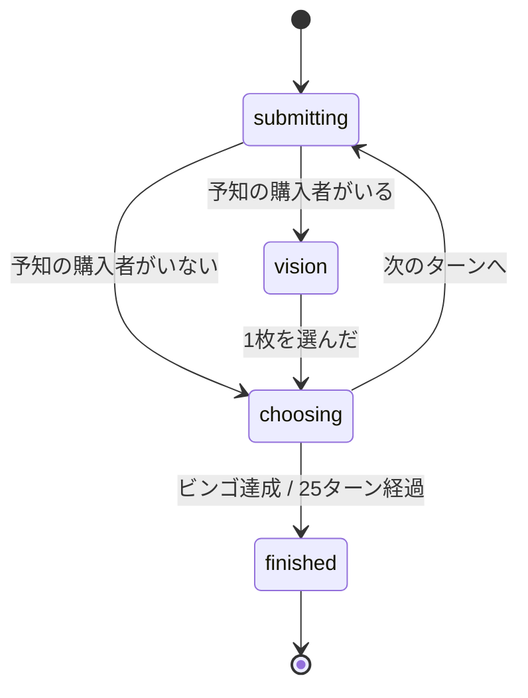

# プロジェクト用語集 (Glossary)

## 概要

本プロジェクトで使用する用語を定義する。**ドキュメントの日本語表記と、コード上の識別子を1対1で対応させる**ことが本書の第一の目的。仕様と実装で語彙がずれると、`docs/functional-design.md` のどの規則がどのコードに対応するのか追えなくなる。

新しいゲーム用語を導入するときは、**実装より先に本書へ追加する**。

**更新日**: 2026-07-21

---

## 対応表(クイックリファレンス)

### ゲームの基本要素

| 日本語 | 英語 | 識別子 | 定義 |
|---|---|---|---|
| 盤面 | Board | `Board` / `board` | 各列8個の範囲から5個を選んだ 5×5 のカード |
| マス | Cell | `Cell` | 盤面の1区画。数字または `'FREE'` を持つ |
| FREE マス | Free Cell | `'FREE'` | 中央(N列3行目)。開始時からマーク済み |
| 山札 | Deck | `deck` | 未公開の数字の並び。先頭が次に引かれる |
| ターゲット | Target | `target` / $T$ | そのターンに山札から公開された数字 |
| 列 | Column | `col` | B(1-8) / I(9-16) / N(17-24) / G(25-32) / O(33-40) |
| ライン | Line | `line` | 縦5 + 横5 + 斜め2 = 12本 |
| マーク | Mark | `marked` / `markNumber` | 盤面のマスを埋めること |
| リーチ | Reach | `reachCount` | **4マーク済みのライン**。あと1つで完成する状態 |
| ビンゴ | Bingo | `completedLines` | 1ライン以上が完成した状態 |

### オークション

| 日本語 | 英語 | 識別子 | 定義 |
|---|---|---|---|
| 提出 | Submission | `Submission` / `SUBMIT` | スキルと入札額を同時に決めて出すこと |
| 入札 / 入札額 | Bid | `bid` | オークションに投じるコイン |
| 開札 | Opening | — | 全員の提出を公開すること |
| 落札 | Win the auction | `auctionWinner` | 最高額でオークションに勝つこと |
| 落札者 | Auction winner | `winner` | 落札した者。数字を選ぶ権利を持つ |
| 候補 | Candidates | `candidates` | 落札者が選べる数字の集合 |
| パス | Pass | `value: null` | 落札者が何も選ばないこと |
| 優先権トークン | Priority token | `tokenIndex` | 同額1位の決着に使う。毎ターン時計回りに回転し常時公開 |
| 精算 | Settlement | `Settled` / `settle` | 支払い・分配・返金の処理 |
| 分配 | Distribution | `received` | 敗者が受け取るコイン。$\lfloor 入札額 \div 4 \rfloor$ |
| 銀行 | Bank | `toBank` | 分配されずに経済から消えるコインの行き先 |

### コインとスキル

| 日本語 | 英語 | 識別子 | 定義 |
|---|---|---|---|
| コイン | Coin | `coins` | 唯一のリソース。初期15 / 上限30 / 毎ターン+1 |
| 予約 | Reserve | `reserved` | スキル代を入札に使えないよう確保すること |
| 徴収 | Charge | — | 予約したコインを実際に失うこと |
| 返金 | Refund | `SkillRefunded` | 予約を解除してコインを戻すこと |
| スキル | Skill | `SkillId` | 落札時の選択肢または山札を操作する購入要素 |
| 偏向 | Shift | `'shift'` | コスト4。候補を $\{T-1, T, T+1\}$ に拡張 |
| 予知 | Vision | `'vision'` | コスト5。山札の上3枚を見て1枚を最上位に置く |
| 強奪 | Greed | `'greed'` | コスト6。候補を $\{T-2 \ldots T+2\}$ に拡張 |

### CPU

| 日本語 | 英語 | 識別子 | 定義 |
|---|---|---|---|
| オートマタ / CPU | Agent | `Agent` | 意思決定を行う主体。人間もリモートプレイヤーも同一インターフェース |
| レオ | Leo | `leo` | 「序盤に積む猪突型」 |
| サラ | Sara | `sara` | 「追随して差し込む型」 |
| 傾向 | Tendency | — | CPU の性格を説明する一文。常時開示 |
| テル | Tell | `tell` | 提出前に表示される1語のヒント。**15%のノイズを含む** |
| 公開情報 | Public view | `PublicView` | 全員が見てよい情報 |
| 秘密情報 | Secret view | `SecretView` | 本人だけが見てよい情報 |

---

## ドメイン用語(詳細)

定義だけでは誤解が生じやすい用語を詳述する。

### リーチ

**定義**: **4マーク済みのライン**。あと1つマークすればビンゴになる状態。

**注意**: タイブレークの第1基準は「**リーチラインの本数**」であって「最も進んだラインのマーク数」ではない。この2つは似た日本語になるが、意味も結果もまったく違う。

- ❌「最長リーチ数」= 最も進んだラインのマーク数 → 3人中ほぼ全員が4で並ぶため、単独決着率 **6.1%**
- ✅「リーチラインの本数」= 4マークのラインが何本あるか → 単独決着率 **71.0%**

**関連用語**: ライン / タイブレーク / ビンゴ

**識別子**: `reachCount`

### ターゲット($T$)

**定義**: そのターンに山札から公開された数字。落札者が選べる候補の中心になる。

**説明**: ターン開始時に山札の先頭から1枚引いて公開し、その数字は山札から取り除かれる。**落札者が実際に選んだ数字($T \pm n$)は山札から取り除かない**。このため、既にマークされた数字が後のターンで再び $T$ になることがある(意識的に残した仕様であり、再出現の頻度はシミュレーションで計測する)。

**関連用語**: 山札 / 候補 / 予知

**識別子**: `target`

### 候補

**定義**: 落札者が選べる数字の集合。購入したスキルによって広さが決まる。

| スキル | 候補 | 個数 |
|---|---|---|
| なし | $\{T\}$ | 1 |
| 偏向 | $\{T-1, T, T+1\}$ | 3 |
| 強奪 | $\{T-2 \ldots T+2\}$ | 5 |

**説明**: 1未満・40超になる候補は**クランプも循環もせず除外する**。例えば $T = 1$ で強奪なら候補は $\{1, 2, 3\}$ の3個にしかならない。**列をまたぐことは許す**($T = 8$ で偏向なら $\{7, 8, 9\}$ で B列と I列にまたがる)。

**関連用語**: ターゲット / 偏向 / 強奪 / パス

**識別子**: `candidates` / `candidatesFor()`

### 予約

**定義**: スキルを選択したとき、そのコストを入札に使えないよう確保すること。**確保はするが、まだ失ってはいない**。

**説明**: 徴収のタイミングはスキルによって非対称。

| スキル | 徴収のタイミング | 理由 |
|---|---|---|
| 偏向 / 強奪 | **落札した場合のみ**。落札できなければ返金 | 落札しなければ効果が発生しないため |
| 予知 | **即時**(落札の有無を問わない) | 落札の有無にかかわらず効果が発生するため |

予約制にしたのは、「二重のコスト構造」(オークションかスキルかの配分の悩み)を維持しつつ、「払ったのに落札できず丸損」を防ぐため。紙上トレースで、この丸損によりスキルが実質的に使えなくなることが判明した経緯がある。

**関連用語**: 徴収 / 返金 / スキル

**識別子**: `reserved`

### パス

**定義**: 落札者が候補から何も選ばないこと。誰もマークしない。

**説明**: 盤面命中率が 62.5% のため、スキルを買わずに落札すると約37.5%のターンで「自分が持たない数字を強制的に選ばされ、他者だけがマークする」という**自傷**が発生する。パスを認めることで、これが「$T$ を持たないが相手にも取らせたくない」ターンの**妨害手段**に変わる。終盤では「相手のリーチを完成させる数字しかない」局面で機能する。

**関連用語**: 落札者 / 候補 / 自傷

**識別子**: `{ type: 'CHOOSE', value: null }`

### 優先権トークン

**定義**: 同額1位が出たときに落札者を決める公開マーカー。毎ターン時計回りに回転する。

**説明**: 決着順序は `tokenOrder(i) = [i, (i+1) % n, (i+2) % n, ...]`。トークン保持者を先頭とする時計回りの順序で、同額1位の中から最初に見つかった者が落札する。**予知の競合も同じ順序で決着する**(成功しなかった者には全額返金)。

公開情報のみから決定的に導けることが重要。旧仕様の「同点は全額没収」は、隠匿入札では事故として頻発する上、最も安く降りた者が最大の利益を得るという逆インセンティブがあった。

**関連用語**: 落札 / 予知 / 精算

**識別子**: `tokenIndex` / `tokenOrder()`

### 盤面命中率

**定義**: 公開された数字を自分が盤面に持っている確率。**5/8 = 62.5%**。

**説明**: 各列8個の範囲から5個を選ぶため。スキルで候補を広げると、少なくとも1つを持っている確率は 偏向で約95%、強奪で約99%まで上がる。この「暗算できる価値」がスキル購入の判断材料になるよう数字プールを 1〜40 に設計した。

**関連用語**: 盤面 / 候補 / スキル

### 自傷

**定義**: 落札したにもかかわらず、自分が持たない数字を選ばされ、他者だけがマークしてしまうこと。

**説明**: パスを導入した理由そのもの。用語としてコードには現れないが、設計上の概念として本書に記録する。

**関連用語**: パス / 盤面命中率

### 貯め込み(貯め込みスナイプ)

**定義**: 序盤に入札せずコインを温存し、終盤にまとめて使う戦略。

**説明**: マークは落札しなくても発生するため、リーチ前の序盤は落札の追加価値がほぼゼロになる。このため「序盤は全員が貯め込む」のが最適になりうるという**未解決の懸念**がある。まずコイン上限30がブレーキとして機能するかをシミュレーションで測り、不足する場合の対策候補が**落札者ボーナス**。

**関連用語**: 落札者ボーナス / コイン上限

### 落札者ボーナス(未採用)

**定義**: 落札者が選んだ数字を、自分の盤面に無くてもフリーマークできるという対策候補。

**説明**: **現時点では採用していない。** 貯め込み戦略が有効すぎた場合の予備案として記録する。序盤から落札価値が立ち上がり、自傷の問題も同時に緩和されるが、ゲームが速くなりすぎないか要検証。

**関連用語**: 貯め込み / 自傷

---

## アーキテクチャ用語

### リデューサ(Reducer)

**定義**: 現在の状態とアクションの列から、新しい状態とイベントの列を返す純粋関数。

```typescript
reduce(state: GameState, actions: Action[]): { state: GameState; events: GameEvent[] }
```

**本プロジェクトでの適用**: ゲームの状態遷移はすべてこの関数を通る。UI・タイマー・乱数・I/O に依存しない。この性質により、同じコードが UI からもシミュレーションからも呼べ、P1 でサーバーへ無改変で移送できる。

**関連コンポーネント**: `src/core/reduce.ts`

### 決定性(Determinism)

**定義**: 同一の入力(シード + 操作列)から常に同一の結果が再現される性質。

**本プロジェクトでの適用**: リプレイ・シミュレーション・セーブ復元・デバッグのすべてがこの性質に依存する。担保する手段は3つ。

1. 乱数は `state.rng` からのみ生成する(`Math.random()` の直呼びを ESLint で禁止)
2. `Date.now()` / `new Date()` を `core/` と `agents/` で禁止する
3. セーブは state ではなく `seed + actions[]` を保存し、復元は `reduce` で再計算する

**乱数の消費順序を変えると決定性が壊れる。** リファクタリングで処理順を入れ替える際は特に注意する。

### 公開情報 / 秘密情報(PublicView / SecretView)

**定義**: エージェントに渡してよい情報の境界を型で表現したもの。

**本プロジェクトでの適用**: `PublicView` には `deck` の中身も他者の `submissions` も**含まれない**。CPU はこの型しか受け取らないため、非公開情報を参照しようがない。「CPU はイカサマをしない」を努力目標ではなく**構造的な保証**にしている。

P1 のサーバー化では、**この型がそのままクライアントへの送信可否の境界になる**。

**関連コンポーネント**: `src/core/view.ts` / `src/agents/`

### エージェント(Agent)

**定義**: 意思決定を行う主体の共通インターフェース。

```typescript
interface Agent {
  submit(pub: PublicView, sec: SecretView): { skill: SkillId | null; bid: number };
  chooseNumber(pub, sec, candidates: number[]): number | null;
  selectVision(pub, sec, peeked: number[]): number;
  tell(pub, sec): string;
}
```

**本プロジェクトでの適用**: CPU・人間・(将来の)リモートプレイヤーをすべて同じ型で扱う。オンライン化は実装の差し替えで済み、**空席の CPU 埋めも同じ仕組みで手に入る**。

### ハブ&スポーク

**定義**: 中央のポータル(ハブ)と、独立した個別アプリ(スポーク)からなる構成。

**本プロジェクトでの適用**: 本リポジトリは `fujioha_platform`(Astro のハブ)に対する**スポーク**。独立リポジトリ・独自サブドメイン(`auction-bingo.fujioha.com` を想定)で完結し、ハブとは URL でのみ繋がる疎結合。既存スポーク `kanji_gacha` と同構成。

---

## 状態

### フェーズ(Phase)

ターン内の進行状態。

| 値 | 意味 | 遷移条件 | 次の状態 |
|---|---|---|---|
| `submitting` | 全員の提出待ち | 3人全員が提出 | `vision` または `choosing` |
| `vision` | 予知の成功者が3枚から1枚を選ぶ待ち | 選択完了 | `choosing` |
| `choosing` | 落札者が数字を選ぶ(またはパス)待ち | 選択またはパス | `submitting`(次ターン) / `finished` |
| `finished` | 決着済み | — | — |



### 決着の種別(GameResult.kind)

| 値 | 意味 |
|---|---|
| `bingo` | 単独でビンゴを達成した |
| `draw-bingo` | 落札者が選んだ数字で複数人が同時に達成した(引き分け) |
| `timeup` | 25ターン経過。タイブレークで決着した |
| `draw-timeup` | 25ターン経過。すべての基準で同値(引き分け) |

### 決着の根拠(GameResult.decidedBy)

| 値 | 意味 |
|---|---|
| `bingo` | ビンゴ達成による |
| `reachCount` | リーチラインの本数で決着 |
| `markCount` | 総マーク数で決着(FREE を含む) |
| `coins` | 残りコインで決着 |
| `none` | すべて同値で引き分け |

---

## 技術用語

| 技術 | バージョン | 本プロジェクトでの用途 | 公式サイト |
|---|---|---|---|
| Svelte | 5.56.x | UI 描画。runes による細粒度の反応性 | https://svelte.dev |
| Vite | 8.1.x | ビルドと開発サーバー。静的サイト出力 | https://vite.dev |
| TypeScript | 6.0.x | 型による仕様の担保 | https://www.typescriptlang.org |
| Vitest | 4.1.x | テスト | https://vitest.dev |
| svelte-check | 4.7.x | `.svelte` を含む型チェック(`npm run typecheck`) | — |
| Cloudflare Pages | — | 静的サイトの配信。設定は `wrangler.toml` | https://pages.cloudflare.com |

### runes

**定義**: Svelte 5 の反応性プリミティブ(`$state` / `$derived` / `$effect` など)。

**本プロジェクトでの用途**: `src/ui/game.svelte.ts` で `GameState` を保持する。runes を使うモジュールはファイル名を `*.svelte.ts` にする必要がある。

### 判別可能ユニオン(Discriminated Union)

**定義**: 共通のリテラル型フィールド(判別子)を持つ複数の型の合併。

**本プロジェクトでの用途**: `GameEvent` と `Action` を表現する。`switch` に `never` チェックを添えることで、種別を追加したときの対応漏れをコンパイラに検出させる。

---

## 略語

| 略語 | 正式名称 | 意味 / 本プロジェクトでの使用 |
|---|---|---|
| $T$ | Target | ターゲット番号。ドキュメントと数式内で使う |
| PRD | Product Requirements Document | `docs/product-requirements.md` |
| KPI | Key Performance Indicator | PRD の成功指標。プライマリー7項目 |
| MVP | Minimum Viable Product | P0 の範囲 |
| RNG | Random Number Generator | `src/core/rng.ts`。シードから決定的に生成する |
| CPU | — | オートマタ。実装上は `Agent` |
| P0 / P1 / P2 | — | 優先度。P0 = MVP必須 / P1 = 重要 / P2 = できれば |

---

## 表記のゆれを避ける

同じ概念に複数の呼び方が生まれやすい箇所。**左側を正とする。**

| 正 | 使わない表記 |
|---|---|
| ターゲット | お題 / 対象番号 / 出た数字 |
| 落札者 | 勝者 / 入札勝者(「勝者」はゲームの勝者と紛らわしい) |
| 落札する | 競り勝つ / 買う |
| リーチ**ラインの本数** | 最長リーチ数 / リーチ数(意味が変わる。上記「リーチ」を参照) |
| 予約 | 仮払い / ロック |
| 徴収 | 支払い(「支払い」は入札額の支払いを指す) |
| パス | 見送り / 放棄 |
| 優先権トークン | 手番マーカー / 先攻権 |
| 偏向 / 予知 / 強奪 | シフト / ビジョン / グリード(**日本語表記を正とし、英語は識別子でのみ使う**) |
| オートマタ / CPU | AI(**本プロジェクトの CPU は機械学習を用いないため「AI」と呼ばない**) |
