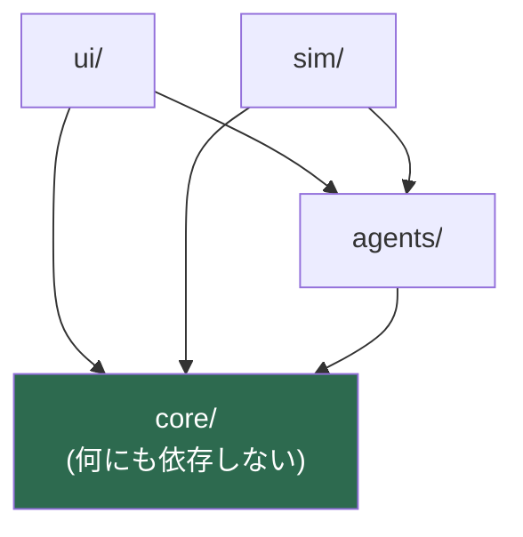

# リポジトリ構造定義書 (Repository Structure Document)

> 本書は `docs/architecture.md` で定義したレイヤー構成を、具体的なディレクトリとファイルに落とし込む。

## プロジェクト構造

```
auction_bingo/
├── src/
│   ├── core/                 # 純粋なゲームロジック(何にも依存しない)
│   ├── agents/               # 意思決定(CPU)
│   ├── sim/                  # 自動対戦シミュレーション(CLI)
│   ├── ui/                   # Svelte コンポーネント
│   └── main.ts               # エントリポイント
├── tests/                    # 統合テスト(ユニットテストは src/ に同居)
├── scripts/                  # ビルド外の実行支援(TS 直接実行用 Node ESM ローダ)
├── docs/                     # 永続ドキュメント6点 + ideas/
├── public/                   # 静的アセット(favicon 等)
├── .steering/                # 作業単位の計画とタスクリスト(★コミットする)
├── .claude/                  # Claude Code のハーネス層
├── .devcontainer/
├── .github/
├── index.html                # Vite のエントリ
├── vite.config.ts
├── vitest.config.ts
├── svelte.config.js
├── eslint.config.js
├── tsconfig.json
├── wrangler.toml             # Cloudflare Pages
└── CLAUDE.md
```

## ディレクトリ詳細

### `src/core/` — ゲームロジック

**役割**: ゲーム状態の生成と遷移、盤面判定、乱数生成。**このプロジェクトの中核であり、唯一の「正しさ」の所在**。

**配置ファイル**:

```
src/core/
├── config.ts            # BalanceConfig の定義・既定値・検証
├── config.test.ts
├── types.ts             # GameState / Board / GameEvent / PublicView 等の型定義
├── rng.ts               # シード付き乱数(mulberry32 相当)
├── rng.test.ts
├── board.ts             # 盤面生成・マーク・ライン判定
├── board.test.ts
├── reduce.ts            # 唯一の状態遷移。createGame / reduce / legalActions(resolve/ を束ねるファサード)
├── reduce.test.ts
├── view.ts              # GameState → PublicView / SecretView の射影
├── view.test.ts
└── resolve/             # ターン解決の各ステップ(reduce.ts から分割)
    ├── turn.ts          # ターン進行の制御
    ├── submit.ts        # 入札・アクションの受付
    ├── vision.ts        # 予知の解決
    ├── auction.ts       # 競り(オークション)の解決
    ├── settle.ts        # 分配・強奪などの決済
    ├── result.ts        # 決着判定
    └── shared.ts        # resolve 内の共通ヘルパ
```

**命名規則**:
- ファイル名は camelCase の名詞または動詞(`reduce.ts` / `board.ts`)。
- 型定義は `types.ts` に集約する。ファイルごとに分散させない(相互参照が多いため)。
- ユニットテストは**同一ディレクトリに `*.test.ts` として同居させる**。

**依存関係**:
- 依存可能: `src/core/` 内の他モジュールのみ
- 依存禁止: `src/ui/` / `src/agents/` / `src/sim/` / `svelte` / **すべての外部ランタイム依存**

**禁止事項**(`eslint.config.js` で機械的に強制する):
- `window` / `document` / `localStorage` / `fetch` / `console` の参照
- `Math.random()` / `Date.now()` / `new Date()` の呼び出し

### `src/agents/` — 意思決定

**役割**: `PublicView` と `SecretView` からアクションを決定する。CPU とシミュレーション用戦略の置き場。

```
src/agents/
├── types.ts             # Agent インターフェース
├── registry.ts          # 名前 → Agent の生成(createAgent)。sim/ から利用する公開 API
├── leo.ts               # 猪突型
├── leo.test.ts
├── sara.ts              # 追随型
├── sara.test.ts
├── shared.ts            # CPU 共通の意思決定ロジック(desire / bestLine / tell 等)
├── shared.test.ts
├── constants.ts         # CPU の閾値・係数(★シミュレーションで調整する値)
├── testkit.ts           # テスト用ビルダ・対局ドライバ
├── baseline.test.ts
└── baseline/            # シミュレーション専用の戦略
    ├── hoarder.ts       # 常に貯め込む
    ├── allIn.ts         # 常に最大入札
    ├── noSkill.ts       # スキルを買わない
    └── random.ts        # ランダム
```

**命名規則**: CPU キャラクターはキャラクター名を camelCase で(`leo.ts` / `sara.ts`)。戦略は振る舞いを表す名前で(`hoarder.ts`)。

**`human.ts` は作らない。** 人間の手番ではアクションが UI から直接 `reduce` に渡るため、`Agent` を経由させる意味がない。座席のうちどれが `Agent` でどれが UI 入力かを決めるのは、`core/` ではなく呼び出し側(`ui/` / `sim/`)の責務とする。

**依存関係**:
- 依存可能: `src/core/` の**型と純粋関数のみ**
- 依存禁止: `src/ui/` / `src/sim/` / `svelte`

**重要な制約**: `agents/` の関数は **`GameState` 全体を引数に取ってはならない**。受け取るのは `PublicView` と `SecretView` だけ。これが「CPU は非公開情報を参照しない」という PRD の受け入れ条件を構造的に保証する唯一の仕組みであり、ここを緩めると保証が消える。

**`constants.ts` を独立させる理由**: CPU の閾値はシミュレーションで調整する対象であり、ロジックとは変更頻度が違う。混ぜると調整のたびにロジックの diff が汚れる。

### `src/sim/` — 自動対戦シミュレーション

**役割**: KPI の計測。Node.js 上で CLI として動く。

```
src/sim/
├── run.ts               # CLI エントリ(引数解析)
├── play.ts              # 1ゲームを最後まで自動進行させる
├── metrics.ts           # KPI の集計(ビンゴ発生率・相関・スキル比率など)
└── metrics.test.ts
```

**依存関係**:
- 依存可能: `src/core/` / `src/agents/`
- 依存禁止: `src/ui/`

**実行方法**:

```bash
npm run sim -- --games 10000 --seed 1 --agents leo,sara,hoarder
```

TS をビルドせず直接実行するため、`scripts/`(ルート直下)の Node ESM ローダ
(`ts-loader.mjs` = 拡張子なし import を `.ts` に補完する resolve フック / `register-loader.mjs` = その登録エントリ)を
`node --import` 経由で噛ませる。Node 24 のネイティブ型ストリップと併用し、新規 npm 依存を増やさない。

**この層だけは `console` の使用を許可する**(CLI の出力手段であるため)。ESLint の制限は `core/` と `agents/` にのみ適用する。

### `src/ui/` — 表示

**役割**: `state` の描画、入力のアクションへの変換、`localStorage` への退避、演出。

```
src/ui/
├── App.svelte
├── global.css
├── game.svelte.ts           # runes による state 保持。reduce を呼ぶだけ
├── game.test.ts
├── storage.ts               # localStorage への保存・復元
├── storage.test.ts
├── components/
│   ├── BoardView.svelte
│   ├── SubmitPanel.svelte
│   ├── TellBadge.svelte
│   ├── ResolveLog.svelte
│   ├── TokenMark.svelte
│   └── ResultPanel.svelte
└── replay/
    ├── ReplayView.svelte
    ├── replay.ts          # events 列をターン単位へ整形する純粋関数 + 表示ラベル
    └── replay.test.ts
```

**命名規則**:
- Svelte コンポーネントは **PascalCase**(`BoardView.svelte`)。
- runes を使う TS モジュールは Svelte の規約に従い **`*.svelte.ts`**(`game.svelte.ts`)。
- それ以外の TS は camelCase(`storage.ts`)。

**依存関係**:
- 依存可能: `src/core/` / `src/agents/`
- 依存禁止: `src/sim/`

**禁止事項**: **ルール判断の実装**。「この入札は不正か」「誰が落札したか」「ビンゴか」を UI で判定してはならない。UI が持ってよいのは「`legalActions` が返した範囲でしか入力させない」という制約表現までとする。

### `tests/` — 統合テスト

**ユニットテストは `src/` に同居させ、`tests/` には統合テストのみを置く。**

```
tests/
├── determinism.test.ts      # 同一 seed + actions から同一 state / events
├── coinConservation.test.ts # コイン保存則
├── saveRestore.test.ts      # seed + actions からの復元一致
├── informationBarrier.test.ts # PublicView に秘匿情報が含まれないこと
└── support/
    └── driver.ts            # 統合テスト共通のゲーム進行ヘルパー
```

**ユニットテストを同居させる理由**: `core/` は純粋関数の集合で、実装とテストが1対1に対応する。距離が近いほど更新漏れが起きにくい。一方で統合テストは複数モジュールにまたがり対応先が特定できないため、`tests/` に分ける。

**E2E テストは P0 では作らない。** 必要になった時点で `tests/e2e/` を追加する。

### `docs/` — ドキュメント

```
docs/
├── product-requirements.md    # PRD
├── functional-design.md       # 機能設計書(ゲームルールの正典)
├── architecture.md            # 技術仕様書
├── repository-structure.md    # 本書
├── development-guidelines.md  # 開発ガイドライン
├── glossary.md                # 用語集
└── ideas/
    ├── initial-requirements.md  # 設計判断の経緯(Ver 3.3)
    └── memo.txt                 # 最初の着想(Ver 2.3)
```

`docs/ideas/` は**履歴として残す**。28件の設計判断とその理由が記録されており、「なぜこのルールなのか」を後から再検討する際の一次資料になる。

### `public/` — 静的アセット

favicon、OGP 画像など。**Vite がそのまま `dist/` にコピーする。** ここに置くファイルはバンドルされないため、ハッシュ付きファイル名にならない。バンドルさせたい画像は `src/` 側に置いて import する。

### `.steering/` — 作業単位の計画

```
.steering/
└── [YYYYMMDD]-[task-name]/
    ├── requirements.md
    ├── design.md
    └── tasklist.md
```

**★このディレクトリは `.gitignore` に入れず、履歴としてコミットする。** 一般的なテンプレートでは一時ファイルとして除外することがあるが、本プロジェクトでは CLAUDE.md の方針に従い、作業の意図と経緯を残すために保持する。

## ファイル配置規則

### ソースファイル

| ファイル種別 | 配置先 | 命名規則 | 例 |
|------------|--------|---------|-----|
| ゲームロジック | `src/core/` | camelCase | `reduce.ts` |
| 型定義 | `src/core/types.ts` | 集約 | — |
| バランス定数 | `src/core/config.ts` | 集約 | — |
| CPU | `src/agents/` | キャラクター名 camelCase | `leo.ts` |
| CPU の閾値 | `src/agents/constants.ts` | 集約 | — |
| シミュレーション戦略 | `src/agents/baseline/` | 振る舞い名 camelCase | `hoarder.ts` |
| Svelte コンポーネント | `src/ui/components/` | PascalCase | `BoardView.svelte` |
| runes を使うモジュール | `src/ui/` | `*.svelte.ts` | `game.svelte.ts` |
| CLI | `src/sim/` | camelCase | `run.ts` |

### テストファイル

| テスト種別 | 配置先 | 命名規則 | 例 |
|-----------|--------|---------|-----|
| ユニットテスト | 対象と同一ディレクトリ | `[対象].test.ts` | `src/core/reduce.test.ts` |
| 統合テスト | `tests/` | `[観点].test.ts` | `tests/determinism.test.ts` |
| E2E テスト | `tests/e2e/`(P0 では作らない) | `[シナリオ].test.ts` | — |

### 設定ファイル

| ファイル種別 | 配置先 | 備考 |
|------------|--------|------|
| ツール設定 | プロジェクトルート | `vite.config.ts` / `vitest.config.ts` / `eslint.config.js` / `svelte.config.js` / `tsconfig.json` |
| デプロイ設定 | プロジェクトルート | `wrangler.toml` |
| **バランス定数** | `src/core/config.ts` | ★ルート直下の `config/` は作らない。ゲームの一部であり、型検査とテストの対象だから |

**`config/` ディレクトリを作らない理由**: バランス定数は環境設定ではなくゲームルールそのもので、変更するとテストが落ちるべき対象。ソースコードとして `src/core/` に置き、型と検証関数(`validateConfig`)を伴わせる。

## 命名規則

### ディレクトリ名

- すべて **小文字 kebab-case**。
- レイヤーは役割を表す単数形(`core` / `ui` / `sim`)。複数の実装を並べる場所のみ複数形(`agents` / `components`)。

### ファイル名

| 種別 | 規則 | 例 |
|---|---|---|
| Svelte コンポーネント | PascalCase | `BoardView.svelte` |
| TypeScript モジュール | camelCase | `reduce.ts` / `board.ts` |
| runes を使うモジュール | camelCase + `.svelte.ts` | `game.svelte.ts` |
| テスト | `[対象].test.ts` | `reduce.test.ts` |

**クラス名によるファイル命名(PascalCase の `.ts`)は使わない。** `core/` は純粋関数で構成し、クラスを持たないため。

### 識別子

| 種別 | 規則 | 例 |
|---|---|---|
| 型・インターフェース | PascalCase | `GameState` / `BalanceConfig` |
| 関数・変数 | camelCase | `completedLines` / `tokenIndex` |
| 定数(モジュールレベル) | UPPER_SNAKE_CASE | `DEFAULT_CONFIG` / `LINE_INDICES` |
| イベント種別 | PascalCase | `'AuctionResolved'` |
| アクション種別 | UPPER_SNAKE_CASE | `'SUBMIT'` / `'CHOOSE'` |

**ゲーム用語は `docs/glossary.md` の表記に従う。** 識別子とドキュメントで語彙がずれると、仕様と実装の対応が追えなくなる。

## 依存関係のルール

### レイヤー間の依存



**許可される依存**:
- `ui/` → `agents/` / `core/`
- `sim/` → `agents/` / `core/`
- `agents/` → `core/`(型と純粋関数のみ)

**禁止される依存**:
- `core/` → 他のすべて(❌)
- `agents/` → `ui/` / `sim/`(❌)
- `sim/` → `ui/`(❌)
- `ui/` → `sim/`(❌)

**この規則は ESLint(`no-restricted-imports`)で機械的にエラーにする。** レビューの目視に頼らない。設定は最初の実装チケットで導入する。

### 循環依存の禁止

`core/` 内部でも循環依存を作らない。想定される依存の向きは:

```
types.ts ← config.ts ← rng.ts ← board.ts ← reduce.ts
                                    ▲
                                 view.ts
```

`types.ts` は型のみを持ち、実装を持たない。これにより相互参照が必要な場面でも循環が発生しない。

## スケーリング戦略

### 機能の追加

| 規模 | 方針 | 例 |
|---|---|---|
| 小 | 既存ファイルに追加 | 新しいイベント種別を `types.ts` に追加 |
| 中 | レイヤー内にファイルを追加 | 3体目の CPU → `src/agents/新キャラ.ts` |
| 大 | レイヤー内にサブディレクトリを作成 | リアクションスキル(P2)→ `src/core/skills/` |

**P1 のサーバー化では `src/core/` を別パッケージとして切り出す**ことになる。そのときの分離コストを下げるため、`core/` から外向きの依存を作らないという規則を今から守る。

### ファイルサイズの管理

- 300行以下を推奨。
- 300〜500行でリファクタリングを検討。
- 500行以上は分割を強く推奨。

**`reduce.ts` は肥大化しやすい**(ターン解決の各ステップを含むため)。issue #7 で500行を超えたため、ステップ単位で `core/resolve/` 配下に分割済み(現 `reduce.ts` はそれらを束ねるファサード)。分割してもエクスポートする関数は `reduce` 1つに保ち、外から見た形を変えない。

## 除外設定

### `.gitignore`

```
node_modules/
dist/
coverage/
.env
*.log
.DS_Store
```

**`.steering/` は除外しない。** 作業の意図と経緯を履歴として残すため(CLAUDE.md の方針)。

### `.prettierignore` / ESLint の `ignores`

```
node_modules/
dist/
coverage/
.steering/
```

`.steering/` は整形・静的解析の対象外とする(作業記録であり、コード品質の対象ではないため)。

## 特殊ディレクトリ

### `.claude/` — ハーネス層

```
.claude/
├── commands/     # スラッシュコマンド
├── skills/       # タスクモード別スキル
├── agents/       # subagent 定義
├── hooks/        # SessionStart 等のフック
├── scripts/      # フックから呼ばれるスクリプト
├── docs/         # 恒久参照するガイド
└── settings.json
```

更新は `/harness-setup` を通じて行う。手で編集した場合、CI の「Harness integrity」ジョブがフックの実行権限と `settings.json` の構文を検証する。

### `.devcontainer/` / `.github/`

開発環境とCIの定義。`ci.yml` が push / PR ごとに lint・型チェック・テスト・整形・ビルド・secretlint を実行する。
